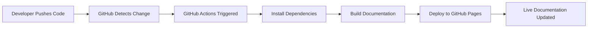

# 📚 Automated Documentation with MkDocs + GitHub Actions

[](https://github.com/PouyanNorouzi/COMP4964ProjectDemo/actions/workflows/docs.yml)
[](https://pouyanorouzi.github.io/COMP4964ProjectDemo/)
[](LICENSE)

A comprehensive demonstration of **modern documentation automation** using MkDocs and GitHub Actions. This project showcases how documentation can be seamlessly integrated into your DevOps workflow with automatic builds and deployments.

## 🌟 Live Demo

**[View the live documentation →](https://pouyanorouzi.github.io/COMP4964ProjectDemo/)**

---

## 🎯 Project Overview

This project demonstrates a complete automated documentation pipeline where:

1. ✍️ **Write** documentation in simple Markdown
2. 📝 **Commit** changes to the repository
3. 🚀 **Push** to the main branch
4. 🤖 **Automatic** build and deployment via GitHub Actions
5. 🌐 **Live** documentation on GitHub Pages

No manual deployment steps. No outdated docs. Just push and go!

---

## ✨ Key Features

- **🤖 Fully Automated**: Zero-touch deployment on every push to main
- **🎨 Modern UI**: Material Design theme with built-in search
- **📱 Responsive**: Mobile-friendly documentation layout
- **🔍 Searchable**: Full-text search across all documentation
- **⚡ Fast**: Static site generation for instant page loads
- **📊 Version Controlled**: Full documentation history in Git
- **🆓 Free Hosting**: Powered by GitHub Pages
- **🔄 Live Reload**: Instant preview during local development

---

## 🛠️ Technology Stack

| Component | Technology | Purpose |
|-----------|------------|---------|
| **Documentation Generator** | [MkDocs](https://www.mkdocs.org/) | Converts Markdown to static HTML |
| **Theme** | [Material for MkDocs](https://squidfunk.github.io/mkdocs-material/) | Modern, responsive design |
| **CI/CD** | [GitHub Actions](https://github.com/features/actions) | Automated build and deployment |
| **Hosting** | [GitHub Pages](https://pages.github.com/) | Free static site hosting |
| **Content Format** | Markdown | Simple, developer-friendly authoring |

---

## 🚀 Quick Start

### Prerequisites

- Python 3.7 or higher
- pip (Python package manager)
- Git

### Local Setup

1. **Clone the repository**
   ```bash
   git clone https://github.com/PouyanNorouzi/COMP4964ProjectDemo.git
   cd COMP4964ProjectDemo
   ```

2. **Install dependencies**
   ```bash
   pip install mkdocs mkdocs-material
   ```

3. **Start the development server**
   ```bash
   mkdocs serve
   ```

4. **Open in browser**
   Navigate to: `http://127.0.0.1:8000`

That's it! You'll see the documentation with live reload enabled.

---

## 📂 Project Structure

```
COMP4964ProjectDemo/
├── .github/
│   └── workflows/
│       └── docs.yml          # GitHub Actions workflow
├── docs/                      # Documentation source files
│   ├── index.md              # Homepage
│   ├── introduction.md       # Project introduction
│   ├── setup-guide.md        # Setup instructions
│   └── faq.md                # FAQ page
├── mkdocs.yml                # MkDocs configuration
└── README.md                 # This file
```

---

## 🔄 How It Works

### The Automation Pipeline



### GitHub Actions Workflow

When you push to the `main` branch:

1. **Checkout**: GitHub Actions checks out the repository
2. **Setup**: Installs Python and required packages
3. **Build**: Runs `mkdocs build` to generate static site
4. **Deploy**: Publishes to the `gh-pages` branch
5. **Live**: Documentation is automatically updated online

No manual intervention required! 🎉

---

## 📝 Making Changes

### Adding New Content

1. Create a new Markdown file in the `/docs` directory:
   ```bash
   echo "# New Page" > docs/new-page.md
   ```

2. Update `mkdocs.yml` to add it to navigation:
   ```yaml
   nav:
     - Home: index.md
     - New Page: new-page.md
   ```

3. Commit and push:
   ```bash
   git add .
   git commit -m "Add new page"
   git push
   ```

4. Watch the magic happen! Your changes will be live in minutes.

### Editing Existing Pages

Simply edit any `.md` file in the `/docs` directory, commit, and push. GitHub Actions handles the rest.

---

## 🎨 Customization

### Theme Configuration

Edit `mkdocs.yml` to customize the site:

```yaml
site_name: Your Project Name
theme:
  name: material
  palette:
    primary: indigo
    accent: indigo
  features:
    - navigation.tabs
    - navigation.sections
    - search.highlight
```

### Adding Features

The Material theme offers many features:

- Dark mode toggle
- Social cards
- Code annotations
- Content tabs
- And much more!

Check the [Material theme documentation](https://squidfunk.github.io/mkdocs-material/) for all options.

---

## 🧪 Testing Locally

### Build the Site

```bash
mkdocs build
```

This generates static HTML in the `./site` directory.

### Serve Locally

```bash
mkdocs serve
```

Access at `http://127.0.0.1:8000` with live reload.

### Clean Build

```bash
mkdocs build --clean
```

Removes old files before building.

---

## 🌐 Deployment

### Automatic Deployment (Default)

Just push to `main` and GitHub Actions does the rest:

```bash
git push origin main
```

### Manual Deployment

If you prefer to deploy manually:

```bash
mkdocs gh-deploy
```

This builds and pushes to the `gh-pages` branch.

---

## 📊 Monitoring Deployments

### Check Build Status

1. Go to the **Actions** tab in your GitHub repository
2. View the latest workflow run
3. Check logs for any issues

### View Deployment Status

- **Badge**: The badge at the top shows current status
- **GitHub Pages**: Settings → Pages shows deployment status
- **Live Site**: Visit the URL to see your changes

---

## 🎓 Educational Value

This project demonstrates:

- **DevOps Principles**: Automation, CI/CD, Infrastructure as Code
- **Documentation Best Practices**: Treating docs as code
- **GitHub Actions**: YAML workflow configuration
- **Static Site Generation**: How tools like MkDocs work
- **Git Workflows**: Version control for documentation
- **Markdown Authoring**: Writing technical documentation

Perfect for COMP4964 students learning DevOps practices!

---

## 🤝 Contributing

Contributions are welcome! Here's how:

1. **Fork** the repository
2. **Create** a feature branch: `git checkout -b feature/new-docs`
3. **Make** your changes
4. **Test** locally: `mkdocs serve`
5. **Commit**: `git commit -m "Add new documentation"`
6. **Push**: `git push origin feature/new-docs`
7. **Submit** a Pull Request

---

## 📖 Additional Resources

### Documentation

- [MkDocs Official Docs](https://www.mkdocs.org/)
- [Material for MkDocs](https://squidfunk.github.io/mkdocs-material/)
- [GitHub Actions Documentation](https://docs.github.com/en/actions)
- [Markdown Guide](https://www.markdownguide.org/)

### Related Projects

- [Read the Docs](https://readthedocs.org/)
- [Docusaurus](https://docusaurus.io/)
- [Sphinx](https://www.sphinx-doc.org/)
- [VuePress](https://vuepress.vuejs.org/)

---

## 🐛 Troubleshooting

### Build Fails

- Check the Actions logs for specific errors
- Validate `mkdocs.yml` syntax
- Ensure all referenced files exist

### Local Server Issues

- Verify port 8000 is available
- Try a different port: `mkdocs serve -a localhost:8080`
- Clear browser cache

### Deployment Problems

- Check GitHub Pages is enabled (Settings → Pages)
- Ensure Actions has write permissions
- Verify `gh-pages` branch exists

---

## 📄 License

This project is licensed under the MIT License - see the [LICENSE](LICENSE) file for details.

---

## 👤 Author

**Pouyan Norouzi**  
COMP4964 Project - Documentation Automation Demo

---

## 🌟 Acknowledgments

- [MkDocs](https://www.mkdocs.org/) team for the excellent documentation tool
- [Material for MkDocs](https://squidfunk.github.io/mkdocs-material/) for the beautiful theme
- [GitHub](https://github.com/) for Actions and Pages
- COMP4964 course for the learning opportunity

---

## 🔗 Links

- **Live Documentation**: https://pouyanorouzi.github.io/COMP4964ProjectDemo/
- **Repository**: https://github.com/PouyanNorouzi/COMP4964ProjectDemo
- **Issues**: https://github.com/PouyanNorouzi/COMP4964ProjectDemo/issues

---

**Happy Documenting! 📚✨**
